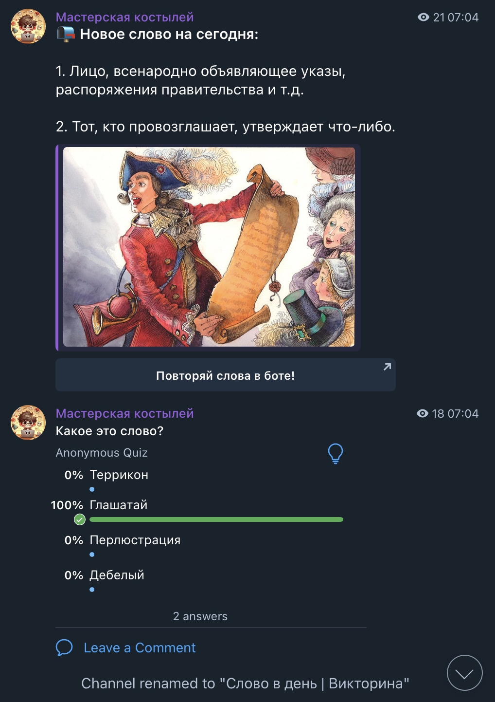

## 🤖 Telegram Bot Demo (tServer)

### Preview

---

### Demo Videos

#### 🎥 Demo Video 1
<video src="assets/demo_video1.mp4" controls width="500"></video>

#### 🎥 Demo Video 2
<video src="assets/demo_video2.mp4" controls width="500"></video>

---

## 👨‍💻 About the Project

This Telegram bot is a personal pet project created for my own Telegram channel.  
Although I am primarily an **iOS developer**, this project represents my **first exploration into backend development using Node.js**.

My goal was to build a production-like backend service without writing UI.  
Telegram’s Bot API was a perfect fit, because it gave me a clean interface for user interaction while I focused on backend logic, architecture, and database integration.

The bot is built with:

- **Node.js** — backend logic  
- **MySQL** — persistent storage  
- **Telegraf.js** — Telegram Bot API framework  
- **node-schedule** — cron-based scheduled posting  

---

## ✨ Bot Functionality

The bot serves two main roles:

### **1. Interactive Quiz Gameplay**
Telegram users can play two quiz types directly in chat with the bot:

- 🧠 **Word Quiz** — guess the “word of the day”
- 🧩 **Fact Quiz** — guess the “fact of the day”

Each quiz is generated dynamically and includes answer buttons.  
Users can request:
- a new random quiz  
- or return to the main bot menu

Relevant code:
- `src/Builders/wordquiz.js`  
- `src/Builders/factquiz.js`  
- `src/Handlers/answers.js`  
- `src/Handlers/menu.js`  

---

### **2. Scheduled Posting to Telegram Channel**
The bot automatically prepares and posts content to a Telegram channel according to a schedule:

- ⏰ *Every day at 10:00* — Word Quiz post  
- ⏰ *Every day at 18:00* — Fact Quiz post  
- ⏰ *Every 3 days at 22:00* — Bot Post (general content)

Implemented via `node-schedule` in:

- `tServer.js`  
- `src/Builders/botpost.js`

This turns the bot into a lightweight automated content generator for the channel.

---

### **3. User Commands & Admin Commands**

#### 🧑‍💻 Regular users can:
- play quizzes  
- switch quiz types  
- open the main menu  
- possibly save favorite words (early feature)

#### 👑 The admin can:
- send bot commands for testing/validating quiz content  
- trigger manual quiz posts  
- inspect message flow  
- receive all incoming user messages for moderation

Admin message handling:
- `src/Handlers/adminHandler.js`  
- admin routing inside `tServer.js`